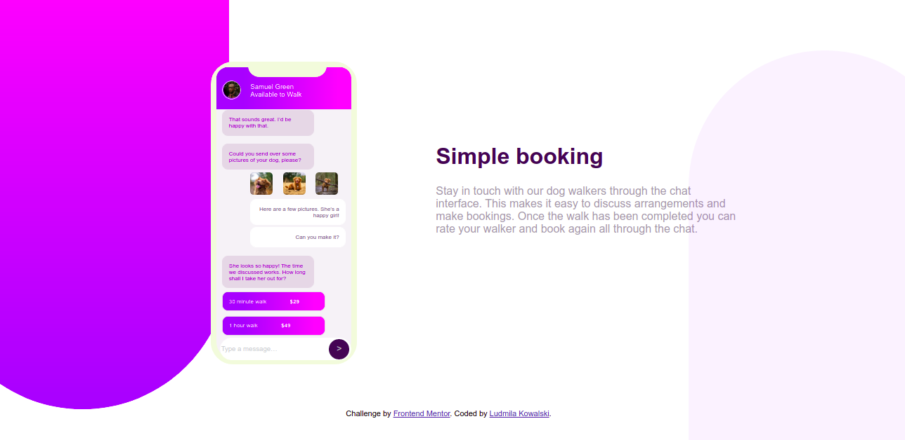

# Frontend Mentor - Chat app CSS illustration solution

This is a solution to the [Chat app CSS illustration challenge on Frontend Mentor](https://www.frontendmentor.io/challenges/chat-app-css-illustration-O5auMkFqY). Frontend Mentor challenges help you improve your coding skills by building realistic projects. 

## Table of contents

- [Overview](#overview)
  - [The challenge](#the-challenge)
  - [Screenshot](#screenshot)
  - [Links](#links)
- [My process](#my-process)
  - [Built with](#built-with)
  - [What I learned](#what-i-learned)
  - [Continued development](#continued-development)
  - [Useful resources](#useful-resources)
- [Author](#author)
- [Acknowledgments](#acknowledgments)

## Overview

### The challenge

Users should be able to:

- View the optimal layout for the component depending on their device's screen size
- **Bonus**: See the chat interface animate on the initial load

### Screenshot

### Links

- Solution URL: https://github.com/LudmilaKowalski/Chat-app-CSS-illustration
- Live Site URL: [Add live site URL here]https://ludmilakowalski.github.io/
Chat-app-CSS-illustration/

## My process

### Built with

- HTML5 markup
- CSS custom properties
- Flexbox

### What I learned

I do this exercice to keep my knoledge in html and css.

### Continued development

I want to continue to improve my maneer to display element on web page.

### Useful resources

- [Css gradient](https://cssgradient.io/) - This helped me for the gradients.
- [Border radius](https://developer.mozilla.org/fr/docs/Web/CSS/border-radius) - This link help me to create proper border radius.

## Author

- Website - [Add your name here](https://ludmilakowalski.github.io/Portfolio/)
- Frontend Mentor - [@LudmilaKowalski](https://www.frontendmentor.io/profile/LudmilaKowalski)

## Acknowledgments

I think it could be good to code mobil first. I don't do that and I have possibly loose some time to readapt my code in mobil version. An easy way to do a full responsive web site his to use this kind of code :

@media only screen and (max-width : 940px)

